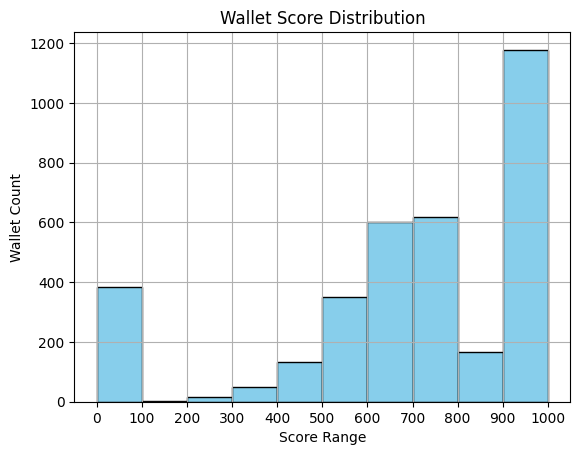

Click to expand the full analysis content

#  Analysis of Wallet Credit Scores

##  Score Distribution

To understand wallet behavior across the Aave V2 ecosystem, we grouped scores into deciles (0–1000) and examined transaction patterns:

| Score Range | Wallet Count | Description |
|-------------|--------------|-------------|
| 0–100       | 385 wallets  | Highly risky behavior: dominated by `Borrow` and `LiquidationCall` actions |
| 100–200     | 1 wallets    | Bot-like usage: minimal `Repay`, sporadic `Deposit` or `RedeemUnderlying` |
| 200–300     | 15 wallets   | Erratic interaction: low-value borrowing, inconsistent repayment |
| 300–400     | 52 wallets   | Unstable strategy: early signs of responsible use but lacking consistency |
| 400–500     | 250 wallets  | Emerging reliability: deposit-repay behavior begins to outweigh risk |
| 500–600     | 242 wallets  | Balanced behavior: steady deposits, repayments counter borrow usage |
| 600–700     | 600 wallets  | Consistent reliability: high-value deposits and repayments dominate |
| 700–800     | 617 wallets  | Trustworthy pattern: rare liquidations, strong redeem-repay cycle |
| 800–900     | 158 wallets  | Highly responsible: minimal risky actions, frequent `Deposit` and `Repay` |
| 900–1000    | 1177 wallets | Model users: continuous responsible behavior across all actions |

##  Behavioral Trends

###  Low-Scoring Wallets (0–300)
- Frequent risky actions like `Borrow` and `LiquidationCall`
- Sparse or absent `Repay` events
- Many low-value or single-action wallets
- Potential bots, exploiters, or test agents

###  Mid-Scoring Wallets (300–700)
- Mixed behavior: repayment and deposit actions present but inconsistent
- Occasionally involved in risky actions
- Likely real users with evolving strategies

###  High-Scoring Wallets (700–1000)
- Heavy involvement in `Deposit`, `Repay`, and `RedeemUnderlying`
- Rarely liquidated; consistent responsible interactions
- Suggests long-term users and positive protocol contributions

---

##  Visual Overview

